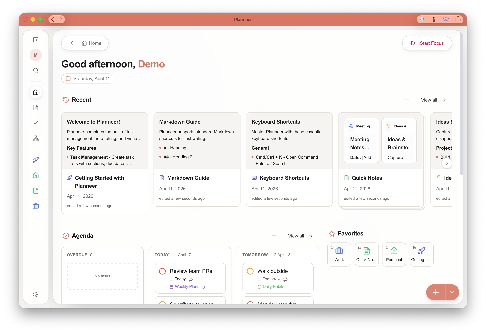
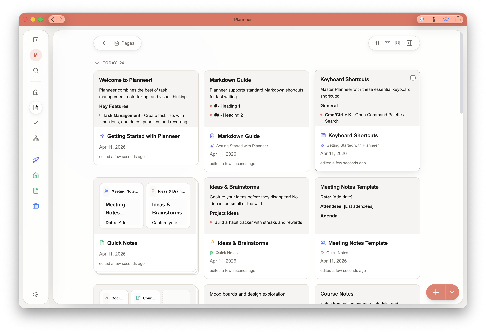
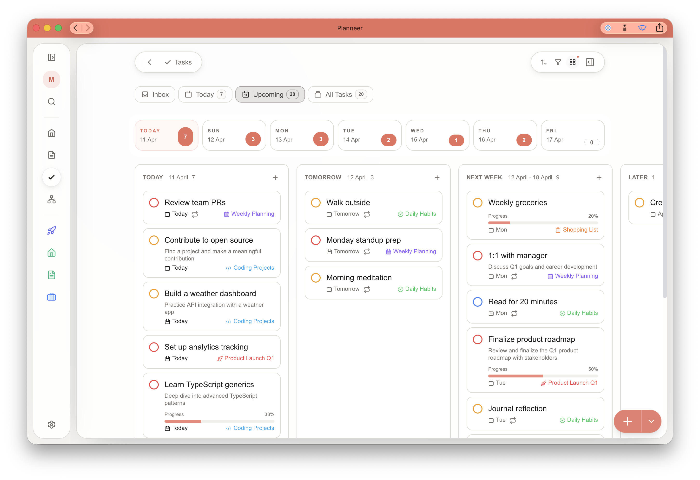
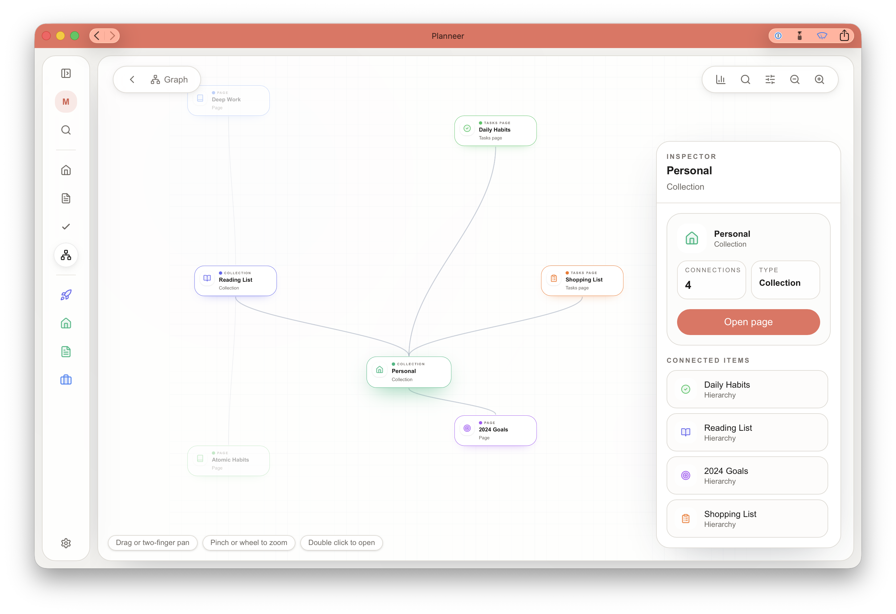
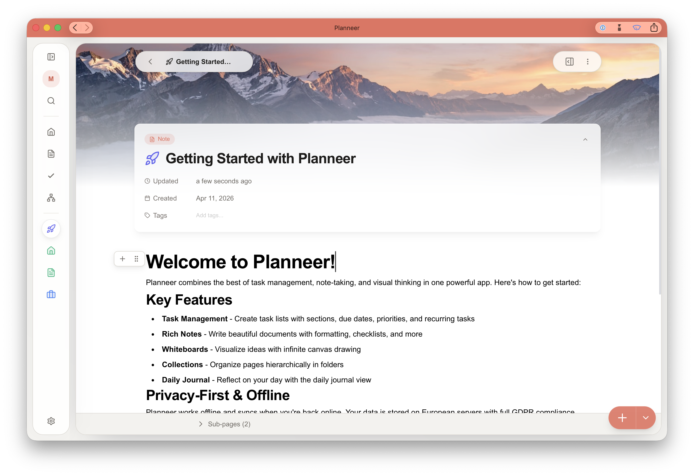
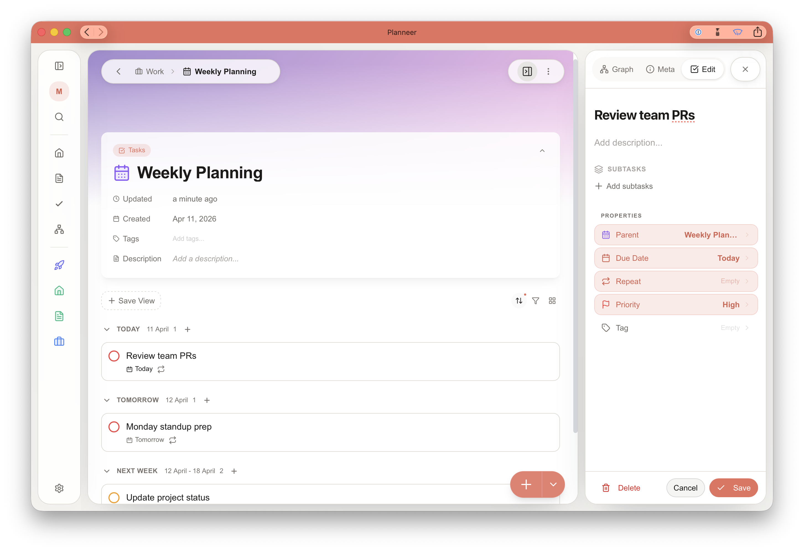

# Planneer

> **A modern, offline-first productivity suite for tasks, notes, and creative work.**

[](LICENSE)

Planneer is a self-hosted productivity application that combines task management, rich note-taking, and structured collections into a unified experience. Built with privacy and offline-first principles at its core.

<p align="center">
  
</p>

## Features

- **Task Management** — Inbox, Today, Upcoming views with smart scheduling and Kanban
- **Rich Notes** — Block-based editor with internal linking, embeds, and slash commands
- **Collections** — Organize content hierarchically with nested pages
- **Offline-First** — Full functionality without internet, automatic sync when online
- **Dark Mode** — Beautiful light and dark themes
- **Responsive** — Works on desktop, tablet, and mobile
- **Single Container** — One Docker image, one port, zero complexity

## Tech Stack

| Layer | Technology |
|-------|-----------|
| Frontend | React 19, Vite 6, TypeScript, Tailwind CSS 4 |
| Routing | TanStack Router (file-based, type-safe) |
| State | Zustand 5 with persist middleware |
| Editor | Yoopta (block-based rich text on Slate) |
| Offline | IndexedDB via Dexie.js |
| Backend | Go 1.23, PocketBase 0.24, SQLite |
| Deploy | Single Docker container |

## Quick Start

### Development

```bash
# Clone the repo
git clone https://github.com/jessevl/planneer.git
cd planneer

# Install frontend dependencies
cd frontend && npm install && cd ..

# Start both servers (two terminals)
make frontend-dev   # Terminal 1 → http://localhost:3000
make backend-dev    # Terminal 2 → http://localhost:8090

# Or use the dev script
./scripts/dev.sh
```

The Vite dev server proxies `/api` requests to the backend automatically.

### Production (Docker)

```bash
# Build the single-container image
make docker-build

# Or deploy with Docker Compose
cd deploy
cp .env.example .env   # Edit with your settings
docker compose up -d
```

Planneer is available at **http://localhost:8090** — the Go backend serves both the API and the frontend static files.

## CI/CD

GitHub Actions now builds the full single-container image from the monorepo:

- Pull requests targeting `main` validate the Docker build
- Pushes to `main` build and publish `ghcr.io/jessevl/planneer`
- Pushes to `main` automatically increment the patch version in [VERSION](VERSION) and publish that versioned image tag
- Release tags like `v1.2.3` publish matching container tags such as `1.2.3` and `1.2`
- Release tags like `v1.2.3` also create a GitHub Release automatically
- Docs-only changes under `docs/`, `screenshots/`, or Markdown-only edits do not trigger the container workflow
- Published tags include `latest`, the branch name, `sha-<commit>`, and release tags

The workflow lives at [.github/workflows/container.yml](.github/workflows/container.yml).

Release flow:

```bash
# Normal releases:
# - leave VERSION alone
# - each push to main bumps the patch version automatically

# Major/minor releases:
# - edit VERSION manually, for example 1.1.0 or 2.0.0
echo "1.1.0" > VERSION
git commit -am "Bump version to 1.1.0"

# Create and push a release tag matching VERSION
git tag v1.1.0
git push origin main --tags
```

## Repository Structure

```
planneer/
├── frontend/           # React/Vite web application
│   ├── src/
│   │   ├── api/       # PocketBase API layer
│   │   ├── components/# React components (ui/, tasks/, pages/, layout/)
│   │   ├── hooks/     # Custom React hooks
│   │   ├── lib/       # Utilities (sync engine, date utils, design system)
│   │   ├── plugins/   # Yoopta editor plugins
│   │   ├── routes/    # TanStack Router file-based routes
│   │   ├── stores/    # Zustand state stores
│   │   └── types/     # TypeScript interfaces
│   ├── e2e/           # Playwright E2E tests
│   ├── frameer/       # UI component library (submodule)
│   └── public/        # Static assets, icons, PWA manifest
│
├── backend/            # Go/PocketBase server
│   ├── main.go        # Entry point, static file serving, security
│   ├── hooks.go       # PocketBase event hooks (SSE, onboarding, limits)
│   ├── routes.go      # Custom API routes (search, export, patch)
│   ├── export.go      # Workspace/page export
│   ├── config/        # App configuration and plan limits
│   ├── migrations/    # Database schema migrations
│   ├── templates/     # New user starter content
│   └── pagepreview/   # Page preview/excerpt generation
│
├── docs/               # Project documentation
│   ├── architecture/   # Architecture, schema, offline sync
│   ├── product/        # Current features and roadmap
│   ├── development/    # Testing, bugs, active engineering docs
│   ├── operations/     # Deployment, security, performance
│   ├── research/       # Exploratory and speculative work
│   └── Archive/        # Historical docs kept for context
│
├── deploy/             # Docker Compose production config
│   ├── docker-compose.yml
│   └── .env.example
│
├── scripts/            # Dev and operational scripts
│   ├── dev.sh         # Start both servers for development
│   ├── backup.sh      # Backup PocketBase data
│   └── restore.sh     # Restore from backup
│
├── Dockerfile          # Single-container multi-stage build
├── Makefile            # Unified build commands
└── LICENSE             # AGPL-3.0
```

## Architecture

Planneer uses a **unified page model** — everything is a "Page" with a `viewMode` field:

| `viewMode` | Description |
|------------|-------------|
| `note` | Rich text documents (Yoopta editor) |
| `collection` | Folders/containers for other pages |
| `tasks` | Task lists with sections and Kanban |

**Data flow:** Components → Zustand stores → Sync engine → PocketBase API → SQLite

**Offline-first:** All data is cached in IndexedDB (Dexie.js). Changes queue locally and sync when online via SSE realtime updates.

**Single container deployment:** The Go binary serves the Vite-built frontend from `/app/frontend/dist` and the PocketBase API on the same port. No nginx, no separate containers, no CORS configuration needed.

See [docs/architecture/ARCHITECTURE.md](docs/architecture/ARCHITECTURE.md) for the full system design.

## Commands

```bash
# Development
make frontend-dev       # Start Vite dev server (port 3000)
make backend-dev        # Start PocketBase dev server (port 8090)
./scripts/dev.sh        # Start both

# Build
make frontend-build     # Build frontend (Vite)
make backend-build      # Build backend binary
make docker-build       # Build single-container Docker image

# Test
make frontend-test      # Run Vitest unit tests
make backend-test       # Run Go tests
make test               # Run all tests

# Lint
make frontend-lint      # TypeScript type-check + ESLint

# Deploy
make docker-build       # Build image
make docker-run         # Run container locally

# Data
make backup             # Backup PocketBase data
make restore FILE=x     # Restore from backup
```

## Documentation

| Document | Description |
|----------|-------------|
| [docs/README.md](docs/README.md) | Documentation hub and section index |
| [docs/architecture/ARCHITECTURE.md](docs/architecture/ARCHITECTURE.md) | System design, data flow, terminology |
| [docs/architecture/SCHEMA.md](docs/architecture/SCHEMA.md) | Database collections and fields |
| [docs/product/FEATURES.md](docs/product/FEATURES.md) | Current feature set |
| [docs/development/TESTING.md](docs/development/TESTING.md) | Test infrastructure and workflows |
| [docs/operations/DEPLOYMENT.md](docs/operations/DEPLOYMENT.md) | Production deployment guide |
| [docs/operations/SECURITY_AUDIT.md](docs/operations/SECURITY_AUDIT.md) | Current security audit summary |
| [deploy/README.md](deploy/README.md) | Production deployment guide |

## Screenshots

**Home** — Dashboard showing today's agenda, recently edited pages, and favorited items at a glance.

<p align="center">
  
</p>

**Pages** — Gallery view of all pages in a collection, with rich content previews and metadata.

<p align="center">
  
</p>

**Tasks — Upcoming** — Calendar-grouped task view spanning today through next week, with priorities and subtask progress.

<p align="center">
  
</p>

**Graph** — Interactive relationship graph of pages and tasks, with a side inspector showing connections for a selected node.

<p align="center">
  
</p>

**Note Editor** — Block-based rich text editor with a cover image, page metadata, and the Yoopta slash-command editor.

<p align="center">
  
</p>

**Task Detail** — Tasks page with sections grouped by date, and an inline task detail panel for editing properties and subtasks.

<p align="center">
  
</p>

## Contributing

See [CONTRIBUTING.md](CONTRIBUTING.md) for guidelines.

## License

This project is licensed under the [GNU Affero General Public License v3.0](LICENSE) (AGPL-3.0).

- You can use, modify, and distribute this software freely
- If you deploy a modified version as a network service, you must make your source code available
- Modifications must also be licensed under AGPL-3.0